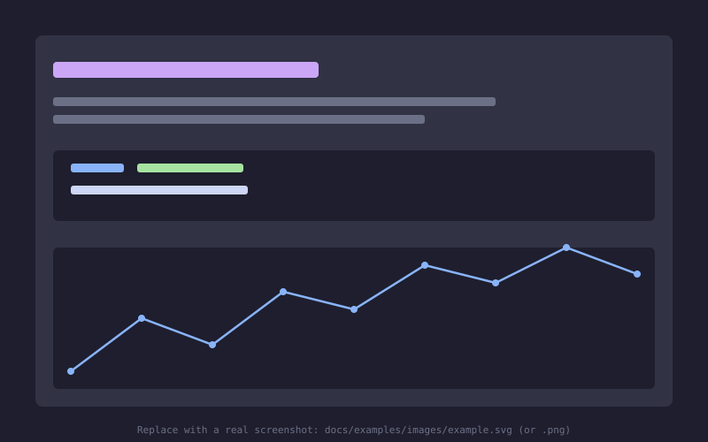

# Examples

Install all example dependencies with pixi:

```bash
pixi install -e dev
```

Then sync and execute all notebooks:

```bash
pixi r nb-run
```

<div class="grid cards" markdown>

- [{ loading=lazy }](/home/sjanke/repos/cosecha/docs/examples/hrrr_example.ipynb "Example HRRR Notebook")
    **Example Notebook**

</div>
